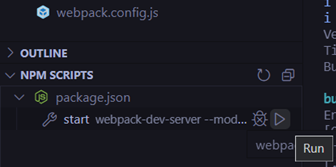
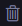
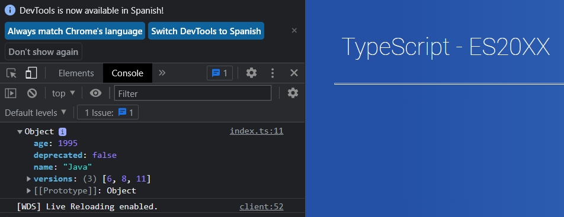

# TypeScript

## Introduction
- Is a superset of JavaScript
- Is a strongly typed, object oriented, compiled language
- Is both a language and a set of tools
- Improves code readability

## Installation
- [Node](https://nodejs.org/es/)

- [VS Code](https://code.visualstudio.com/)

## Run a project
The first step will be to download the necessary node modules to run the project (```node_modules```):

```
PS C:\...\intro-typescript> npm install
```
Are two ways to run the project:
1. Using the command in the directory where the ```package.js``` is:  


```
PS C:\...\intro-typescript> npm start
```


2. From the ```NPM SCRIPTS``` in VS Code:




Are two ways to stop the project:
1. Ctrl + C
2. With the button ```kill terminal```:


## Run exercises
1. Copy code of exercise in ```index.ts``` and comment all the code of the copied file
2. Open the browser developer console:



## Change port
The default port is ```8081```. 

If you need to change it, edit ```package.json >> scripts``` and execute command ```npm start```:

```
"start": "webpack-dev-server --mode development --open --port=8081"
```


